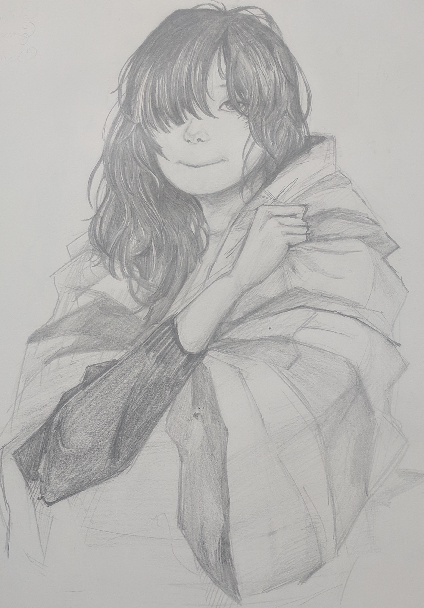

# Introduction 

This repository contains various explorations I have been doing on creating/transforming my artworks using computer neural networks.

Don't forget to click those **Take a look** link which will show you the detailed process and code behind the neural arts.

# My Artworks

I have been taking art classes since I was six.  Over the years I have learned many different art styles: sketches, watercolors, oil paintings, sculptures, mangas ...

[Take a look at some of artworks](images/art.md) I have worked on over the years

# Neural Art

As I grow up, I become heavily involved in computer programming and machine learning projects.  Machine learning through neural networks becomes increasingly popular because of its success on image recognition and processing.

I discovered that I can create or transform many of my paintings in exotic ways, that totally changed my view on arts.

----

## Transfer Art Style -- You can be Monet

I like water ponds and enjoy the serenity of the still life on the pond.  I drew this snow pond picture several years ago in my art class: 

I was quite happy about my drawings until I saw this famous water lilly pond painting from Claude Monet in 1916:
 

How can I draw like Monet?  My art teacher didn't know how to paint impressionistically but I explore the internet and found people were publishing papers on transfering artist style onto a subject painting.  I happened to learn computer neural networks during this time and after some experimentation, I was able to apply Monet's style onto my water pond picture.

[Take a look to see how I did it.](images/style_transfer/style.md)

## Sketch to Color

When I started to learn painting, the first few lessons are spent on sketching: those black-and-white pencil drawings on apples, still objects and later portraits.  I have drawn many of those sketches to practice my strokes, for example the following sketches about a teenage girl:

Naturally I want to add color to those sketches but it will take too much time and effort.  Until recently while I was researching on digital arts I realize that neural networks can be used to add color to black-and-white or gray pictures.  Now I got this done by the computer:

[Take a look to see how I did it.](images/sketch_color/color.md)

# Neural Music

Not only can neural network be used to draw paintings, it can also make music.

When a painter creates a work of art, she first blends and explores colors in her palette before applying to canvas.  In music, we can also create a new music by combining two musical scores.  

[Click here](http://htmlpreview.github.com/?https://github.com/cairachel9/neural_art/blob/master/images/music/magenta.html) see how the two melodies are morphed together.

