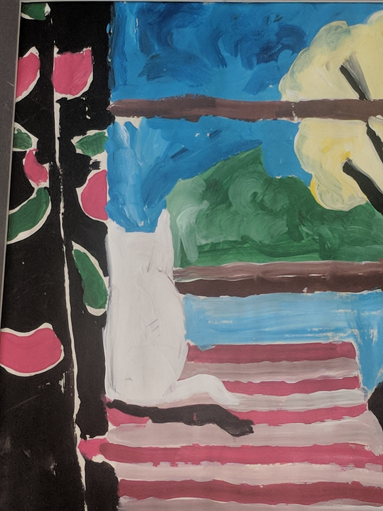
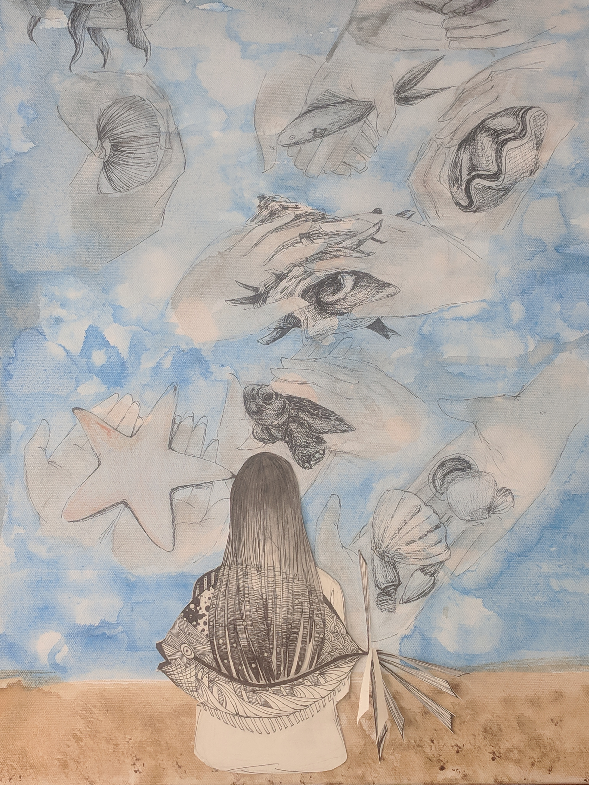
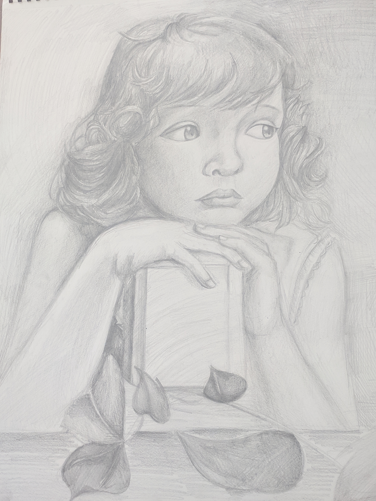
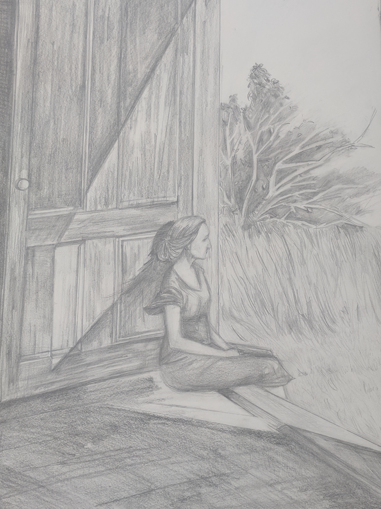
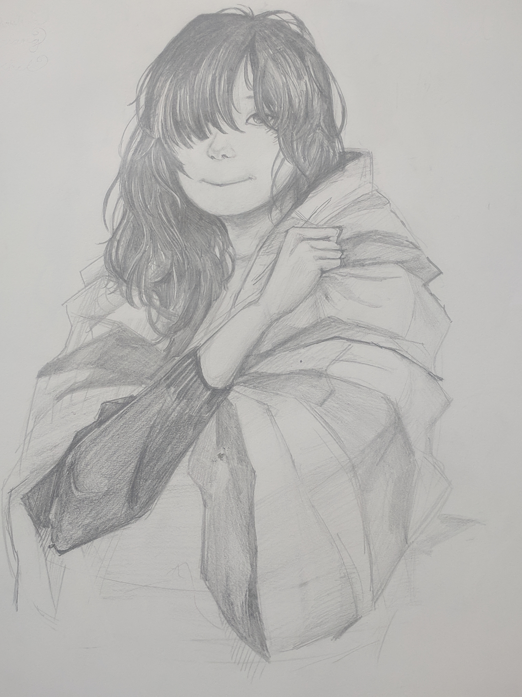

I have been taking art classes since I was six.  Over the years I have learned different art styles: sketches, watercolors, oil paintings, sculptures, mangas ...

Take a look at some of artworks I have worked on over the years.  (Note that **each picture is clickable** to view the full content)

****

The painting I drew at the second grade, I wanted to be a cat.

****

The canvas work I submitted for ocean conservation competition, it's a combination of watercolor and mini scripture.

****

Sketch: a little girl in gaze. 

****

Sketch: woman at the door.

****

Watercolor: vanity woman

****

Painting: still pond

****

Sketch: teenager girl

****
