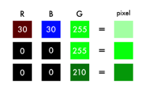
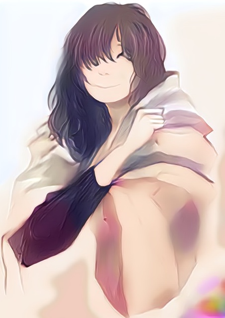

# Introduction

Computer neural network (such as VGG16) as shown on the left are constructed as layers of convolution, pool, relu to automatically extract the feature from the image and later to classify the image (as cat or dog for example). In order to train the network, we feed in millions of cats and dogs pictures with the label and the trains involes hundreds of interation of back tracking and gradient descents until the parameters of network converges.

The neural network can be thought as a function, with picture as input and output labels for the picture.  If we go one step further, we can also train the network to take in Black and white pictures and outputs color pictures.  In the training, we would feed in many black-and-white pictures and with the its corresponding color pictures as the labels, eventually the network will be able to predict the color output given a black and white input.

# Color Space

Black and white images can be represented in grids of pixels. Each pixel has a value that corresponds to its brightness. The values span from 0–255, from black to white.

Color images consist of three layers: a red layer, a green layer, and a blue layer. Just like black and white images, each layer in a color image has a value from 0–255. The value 0 means that it has no color in this layer. If the value is 0 for all color channels, then the image pixel is black.

The version of the colorization neural network has four components.  We split the network into a encoder and a decoder.  Between them, we use a fusion layer.

In parallel to the encoder, we feed the input image through one of the popular neural network architecture: Inception Resnet V2, this is a network trained on 1.2M images.  We extract the classification layer and merge it with the output from the encoder.

By transferring the learning from the classifier to the coloring network, the network can get a sense of what’s in the picture. 

# Validation result

----

----

Here are validation using my own pictures.

On the left are the sketches I drew in the past.

On the right are the pictures with added coloring effect.

----

# Code

For those of you who are interested in the code, [take a look here](full_version.ipynb)

# References

This project is heavily influenced by the work from [Emil Wallner](https://github.com/emilwallner/Coloring-greyscale-images-in-Keras)

[Google's Inception Resnet architecture](https://research.googleblog.com/2016/08/improving-inception-and-image.html)

Code is in [Jupyter Notebook](https://www.floydhub.com/emilwallner/projects/color/43/code/Alpha-version/alpha_version.ipynb)

[Intro to deep learning](https://www.youtube.com/watch?v=LxfUGhug-iQ)
