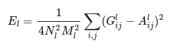

# Introduction

## Neural Network

Computer neural network (such as VGG16) as shown on the left are constructed as layers of convolution, pool, relu to automatically extract the feature from the image and later to classify the image (as cat or dog for example). In order to train the network, we feed in millions of cats and dogs pictures with the label and the trains involes hundreds of interation of back tracking and gradient descents until the parameters of network converges.

## Neural Style Transfer

In fine art, especially painting, humans have mastered the skill to create unique visual experiences through composing a complex interplay between the content and style of an image. 

Neural style transfer is an optimization technique used to take three images, a content image, a style reference image (such as an artwork by a famous painter), and the input image you want to style — and blend them together such that the input image is transformed to look like the content image, but “painted” in the style of the style image.

## Example

Take the following snow pond picture drawn by me as the content image on the left and Claude Monet's waterlily painting as the style image onthe right.  Now how would it look like if I decided to add the texture of style of Monet to my snowy pond?

----

Now Looking Through when we train and merge the pictures from content and style (each picture is shown after each 100 iterations of machine training):

----

We got this snowy pond picture with impressionism style:

# Behind the scene

The principle of neural style transfer is to define two distance functions, one that describes how different the content of two images are, Lcontent, and one that describes the difference between the two images in terms of their style, Lstyle. Then, given three images, a desired style image, a desired content image, and the input image (initialized with the content image), we try to transform the input image to minimize the content distance with the content image and its style distance with the style image.

Content loss function:

Style loss function:

In summary, we’ll take the base input image, a content image that we want to match, and the style image that we want to match. We’ll transform the base input image by minimizing the content and style distances (losses) with backpropagation, creating an image that matches the content of the content image and the style of the style image.

# More Result

My pictures as the content and Vincent Van Goph's sunflower picture as style:

-----

And the result: 

# Code
For those of you who are interested in the code, [take a look here](rachel.ipynb)

# References

This project is heavily influenced by [Raymond Yuan's work](https://medium.com/tensorflow/neural-style-transfer-creating-art-with-deep-learning-using-tf-keras-and-eager-execution-7d541ac31398)

[Neural Style Transfer](https://arxiv.org/abs/1508.06576)

[Why CNN works](https://towardsdatascience.com/intuitively-understanding-convolutions-for-deep-learning-1f6f42faee1)

[Andrew Ng's 21 lessions on machine learning](https://towardsdatascience.com/deep-learning-specialization-by-andrew-ng-21-lessons-learned-15ffaaef627c)
